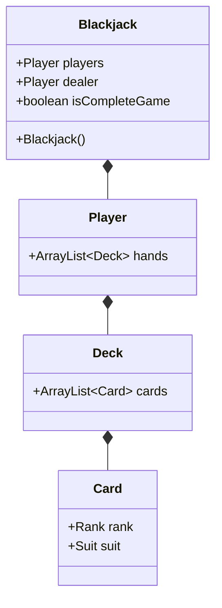

# Blackjack

A basic, text-based blackjack game

```mermaid
classDiagram
    class Blackjack {
        +Player players
        +Player dealer
        +boolean isCompleteGame
        +Blackjack()
    }
    Blackjack *-- Player
    class Player {
        +ArrayList~Deck~ hands
    }
    Player *-- Deck
    class Deck {
        +ArrayList~Card~ cards
    }
    Deck *-- Card
    class Card {
        +Rank rank
        +Suit suit
    }
```
